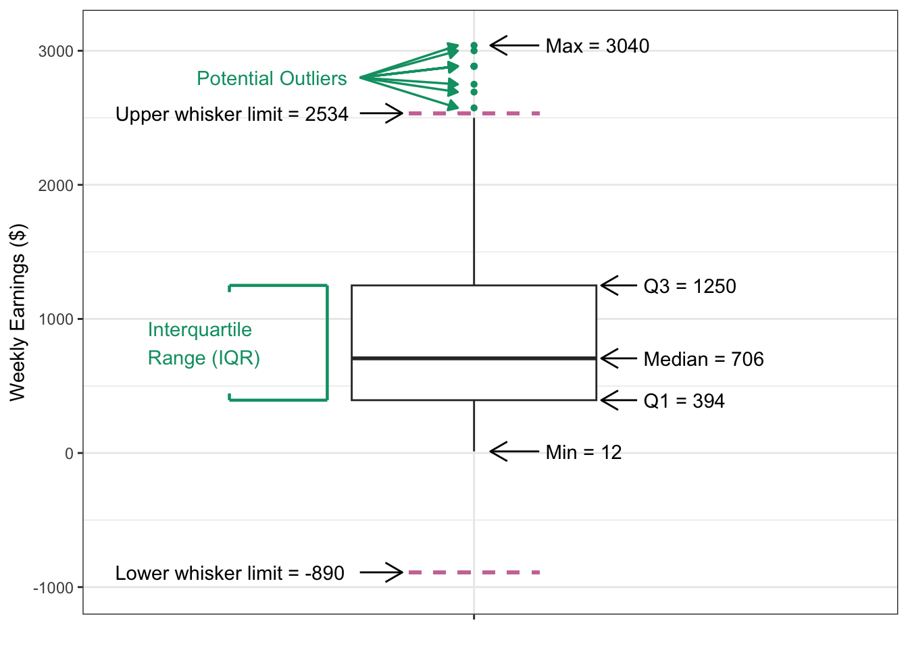

## About the Data

This chapter's data will focus on American Time Use Survey Data on how American spend their time.

## Imports

```{r}
library(hellodatascience)
library(tidyverse)
```

## Data Load

```{r}
data("atus_college")
glimpse(atus_college)

?atus_college
```

## Visualizing a Single Variable

```{r}
#with proper syntax formatting
ggplot(
  data = atus_college, 
  aes(x=employment)
) + 
  geom_bar()
```

```{r}
ggplot(
  data=atus_college,
  aes(x=weekly_earnings)
) +
  geom_histogram(binwidth = 50)
```

```{r}
ggplot(
  data = atus_college,
  aes(y=weekly_earnings)
) + 
  geom_boxplot()
```

## Notes on Box Plot:



## Visualizing Two Variables

```{r}
ggplot(
  data=atus_college,
  aes(x=employment,
      fill=enrollment)
) + geom_bar()

```

```{r}
ggplot(
  data=atus_college,
  aes(x=employment,
      fill=enrollment)
) + geom_bar(position = "fill")

```

```{r}
ggplot(
  data = atus_college, 
  aes(
    x = employment,
    fill = enrollment
  )
) +
  geom_bar(position = "dodge")
```

## Visualizing Two Numeric Variables

```{r}
ggplot(
  data=atus_college,
  aes(
    x=time_alone,
    y=weekly_earnings
  )
  ) + 
  geom_point()
```

## Visualizing a Numerical and a Cateogorical Variable

```{r}
ggplot(
  data = atus_college, 
  aes(
    x = employment,
    y = weekly_earnings
  )
) +
  geom_boxplot()
```

## Visualizing More Than Two Variables

```{r}
ggplot(
  data = atus_college,
  aes(
    x = time_alone,
    y = weekly_earnings,
    color = employment,
    shape = employment
  )
) +
  geom_point()
```
```{r}
ggplot(
  data = atus_college,
  aes(
    x = time_alone,
    y = weekly_earnings,
    color = employment,
    size = work_time
  ) 
) +
  geom_point()
```

